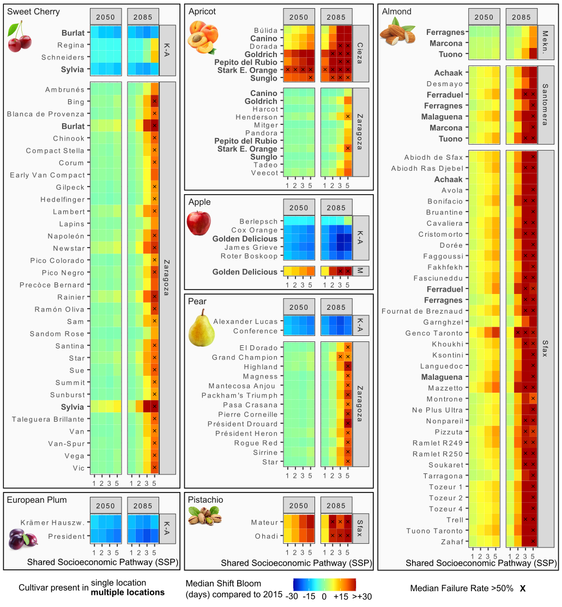

```{r setup, include=FALSE}
knitr::opts_chunk$set(echo = TRUE)
```

This is the accompanying repository for the publication (in preparation).

## Abstract

One of the most widely known manifestations of climate change is an advance in the leaf emergence and flowering of temperate-zone trees. Because warming winters may compromise the trees’ ability to fulfill their chilling requirements, however, spring phenology may also be delayed or, in severe cases, certain development stages (e.g. bloom) may not be reached at all. Information about how particular tree species or cultivars respond to warming is crucial for adaptation planning but has so far been difficult to produce. We addressed this information gap by calibrating the novel PhenoFlex phenology modeling framework with long-term bloom data for 110 cultivars of seven temperate fruit and nut tree species (apple, pear, apricot, sweet cherry, European plum, almond and pistachio), collected in Spain, Tunisia, Morocco and Germany. We used the resulting models to project bloom dates and potential bloom failure (i.e. thermal requirements for flowering are not met at all) for current and future conditions for two time periods (2035–2065, 2070–2100), four warming scenarios (SSP126, SSP245, SSP370, SSP585) and a suite of general circulation models (14-18, depending on the scenario) for six study locations across the four countries. We identified three general trends in projected bloom dates: advancing bloom dates for all species in the temperate climate of Germany, delayed flowering for most species in southern Spain, Tunisia and Morocco and largely unchanged bloom dates in northern Spain and for almonds in Morocco. In the short run (2035–2065), agroclimatic requirements for most species are expected to be met except for apricots in southern Spain and pistachios in central Tunisia. We noted spikes in predicted bloom failure rates for most species in Tunisia, Morocco and southern Spain under pessimistic warming scenarios in the long run (2070–2100) and to a lesser extent also in northern Spain. Within all species, our results revealed cultivar-specific differences for bloom date shifts and failure rates, indicating variation among cultivars in their resilience to warming winters. This may provide an entry point for the design of climate-resilient orchards based on tree cultivars whose thermal requirements are aligned with thermal conditions projected during the trees’ productive life spans. 

## Data

The phenological data used in this study is a subset of the dataset: "Long-term phenology observations for temperate fruit trees in the Mediterranean region (and Germany)". You can find the dataset repository by visiting the following link: https://bonndata.uni-bonn.de/dataset.xhtml?persistentId=doi:10.60507/FK2/MZIELI or use the DOI: https://doi.org/10.60507/FK2/MZIELI

When you use the data, please cite as:

**Long-term phenology observations for temperate fruit trees in the Mediterranean region (and Germany)**
**Luedeling, Eike; Caspersen, Lars; Delgado Delgado, Alvaro; Egea, Jose A.; Ruiz, David; Ben Mimoun, Mehdi; Benmoussa, Haïfa; Ghrab, Mohamed; Kodad, Ossama; El Yaacoubi, Adnane; Fadón, Erica; Rodrigo, Javier, 2024, "Long-term phenology observations for temperate fruit trees in the Mediterranean region (and Germany)", https://doi.org/10.60507/FK2/MZIELI, bonndata, V1** 

## Results

Depending on the location and the modelled species, phenology either advanced, remained constant or delayed. 

```{r phenologyshift-species, echo=FALSE, fig.cap="Changes in median flowering dates, relative to simulated 2015 conditions (black vertical lines), under projected future conditions for four the shared socioeconomic pathways SSP1 (blue horizontal strip), SSP2 (green), SSP3 (yellow), SSP5 (orange) in 2050 (left) and 2085 (right), accompanied by the median rates of unfulfilled thermal requirements (heatmap). Shifts were calculated for each of the 14 to 18 global circulation models (GCM) individually  . The degree of saturation of the strip colors indicates agreement among GCMs, with strong saturation indicating strong agreement.", out.width = '100%'}

```

More importantly, we observed cultivar-specific pattern in phenology shift and unfulfilled thermal requirements. These may hint which cultivars may be more adapted to a changing climate.

```{r phenologyshift-cultivar, echo=FALSE, fig.cap="Heatmap showing changes in median bloom date (days), relative to simulated 2015 conditions, for projected future conditions for four shared socioeconomic pathways (SSP1, SSP2, SSP3, SSP5) summarized at cultivar level. Cultivars with observations from several locations are marked in bold font. Cases with rates of more than 50% unfulfilled thermal requirements are marked with an ‘x’. The modeled location Klein-Altendorf is abbreviated as ‘K-A’ and Meknes as ‘Mekn.’ and ‘M’.", out.width = '100%'}

```

```{r failure-cultivar, echo=FALSE, fig.cap="Heatmap showing the rates of unfulfilled thermal requirements (%) for four shared socioeconomic pathways (SSP1, SSP2, SSP3, SSP5) summarized at cultivar level. Cultivars with observations from several locations are marked in bold font. The modeled location Klein-Altendorf is abbreviated as ‘K-A’ and Meknes as ‘Mekn.’ and ‘M’.", out.width = '100%'}

```